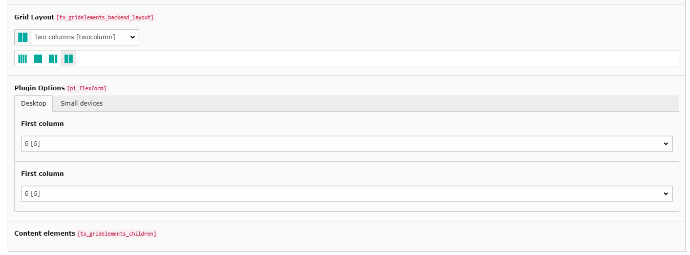

.. ==================================================
.. FOR YOUR INFORMATION
.. --------------------------------------------------
.. -*- coding: utf-8 -*- with BOM.

.. include:: ../Includes.txt

.. _introduction:

Introduction
============

.. _what-it-does:

What does it do?
----------------

This extension provides four predefined grids (1-4 columns) for gridelements based on Bootstrap v4. There are no programming skills necessary.

.. _screenshots:

Screenshots
-----------

.. figure:: ../Images/UserManual/NewGrid.png
   :width: 500px
   :alt: New Grid

   How it looks like in the Background.
