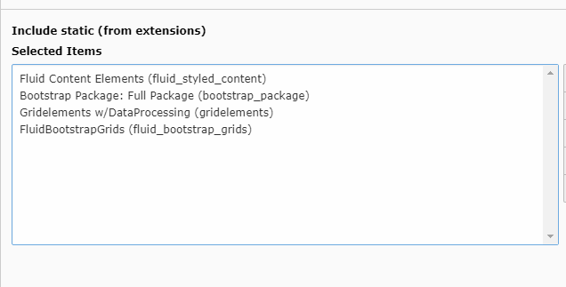
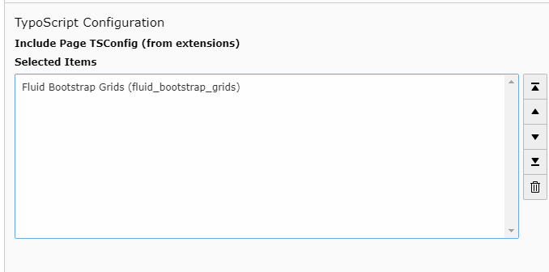

.. ==================================================
.. FOR YOUR INFORMATION
.. --------------------------------------------------
.. -*- coding: utf-8 -*- with BOM.

.. include:: ../Includes.txt

.. _admin-manual:

Administrator Manual
====================

Target group: **Administrators**

.. _admin-installation:

Installation
------------
#. Go to the Extension Manager
 Install the extension
#. Add TypoScript settings in template including Gridelements with Dataprocessing

#. Add Page TsConfig using the page settings

#. Enjoy

Configuration
-------------
At the moment there are no configurations.
